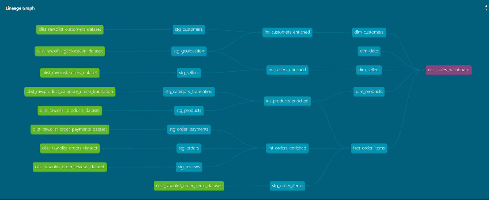
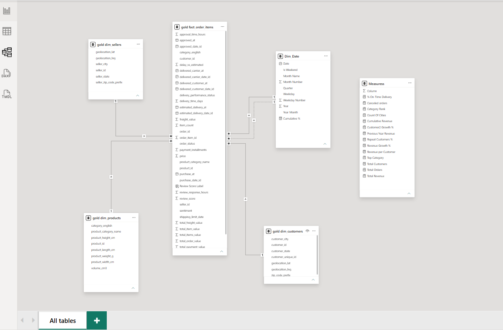
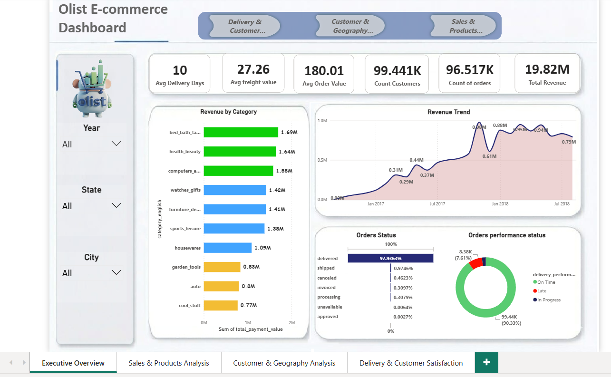

# Olist E-Commerce Data Pipeline (dbt + DuckDB)


## Project Overview

This project transforms raw Olist Brazilian E-Commerce data into an analytics-ready warehouse using dbt and DuckDB.

The pipeline follows a layered architecture (Bronze → Silver → Gold), applying data cleaning, enrichment, dimensional modeling, and data quality validation before delivering a star schema that powers a Power BI dashboard.

The project demonstrates modern Analytics Engineering practices including dbt sources, tests, snapshots, exposures, and CI/CD workflows.

---

## Business Questions

This project helps answer business questions such as:

* What are the top-selling product categories?
* Which sellers generate the highest revenue?
* How do sales trends evolve over time?
* Which customer regions contribute the most orders?
* How does delivery performance affect customer satisfaction?
* How do review scores relate to sales performance?

---

## Architecture



```text
seeds (raw CSVs)
    │
    ▼
staging (cleaning & standardization)
    │
    ▼
intermediate (joins & enrichment)
    │
    ▼
marts (star schema)
    │
    ▼
Power BI Dashboard
```

Raw data is loaded through dbt sources and transformed through a layered architecture that separates ingestion, transformation, and business reporting logic.

The Power BI dashboard is documented as a dbt exposure, creating end-to-end lineage between source data and business reporting.

---

## Tech Stack

* dbt Core
* DuckDB
* SQL
* Power BI
* Git & GitHub
* GitHub Actions
* dbt Snapshots
* dbt Tests
* dbt Exposures

---

## Project Structure

```text
models/
├── staging/
├── intermediate/
└── marts/

snapshots/
seeds/
```

---

## Data Model

### Fact Table

#### fact_order_items

Contains transactional order-level metrics including:

* Revenue
* Payments
* Review information
* Delivery information

### Dimension Tables

#### dim_customers

Customer information and geographic attributes.

#### dim_sellers

Seller information and geographic attributes.

#### dim_products

Product details and translated category names.

#### dim_date

Calendar dimension for time-based analysis.

---

## Data Model Diagram



---

## Key Transformations

### Data Cleaning

* Standardized naming conventions.
* Cast columns to appropriate data types.
* Applied consistent business-friendly field names.
* Defined raw tables as dbt sources.

### Data Enrichment

* Joined orders, products, customers, sellers, reviews, and payments.
* Added translated product categories.
* Added customer and seller geolocation information.

### Data Quality Handling

* Averaged geolocation coordinates by zip code prefix to prevent row duplication.
* Deduplicated reviews by retaining the most recent review per order.
* Validated relationships between fact and dimension tables.

---

## Snapshot Tracking

dbt snapshots are used to capture historical changes for:

* Order status
* Seller location
* Review scores

The implementation uses the dbt `check` strategy to preserve historical records over time.

---

## Data Quality Tests

The project includes 28 dbt tests covering:

* Primary key uniqueness
* Not-null constraints
* Relationship validation
* Referential integrity checks

These tests ensure the reliability and consistency of downstream reporting models.

---

## Project Statistics

* 9 Source Tables
* 9 Staging Models
* 4 Intermediate Models
* 5 Mart Models
* 3 Snapshots
* 28 Data Quality Tests

---

## Dashboard

The Gold Layer powers a Power BI dashboard focused on:

### Sales Analysis

* Revenue trends
* Order trends
* Category performance

### Customer Analysis

* Customer distribution
* Geographic insights
* Customer purchasing behavior

### Seller Analysis

* Seller performance
* Revenue contribution
* Seller distribution

### Delivery & Satisfaction Analysis

* Delivery performance
* Review scores
* Customer satisfaction metrics

### Dashboard Preview



---

## Key Insights

Analysis of the Olist dataset revealed several important findings:

* **bed_bath_table** is the highest revenue-generating product category, contributing approximately **1.69M** in sales.
* Approximately **90% of orders** are delivered on time.
* Average delivery time is approximately **12 days**.
* Customer satisfaction is generally positive, with an average review score close to **4.0**.
* Revenue showed strong growth between **2017 and 2018**.

---

## Running the Project

```bash
# Activate virtual environment
venv\Scripts\activate

# Run models
dbt run

# Execute tests
dbt test

# Run snapshots
dbt snapshot

# Generate documentation
dbt docs generate

# Serve documentation
dbt docs serve
```

---

## Skills Demonstrated

* Analytics Engineering
* Data Modeling
* Dimensional Modeling
* Star Schema Design
* SQL Development
* dbt Development
* dbt Sources
* dbt Snapshots
* dbt Exposures
* Data Quality Testing
* Data Validation
* Power BI Reporting
* CI/CD with GitHub Actions

---

## Dataset

This project is built using the Olist Brazilian E-Commerce Public Dataset and is intended for educational and portfolio purposes.
